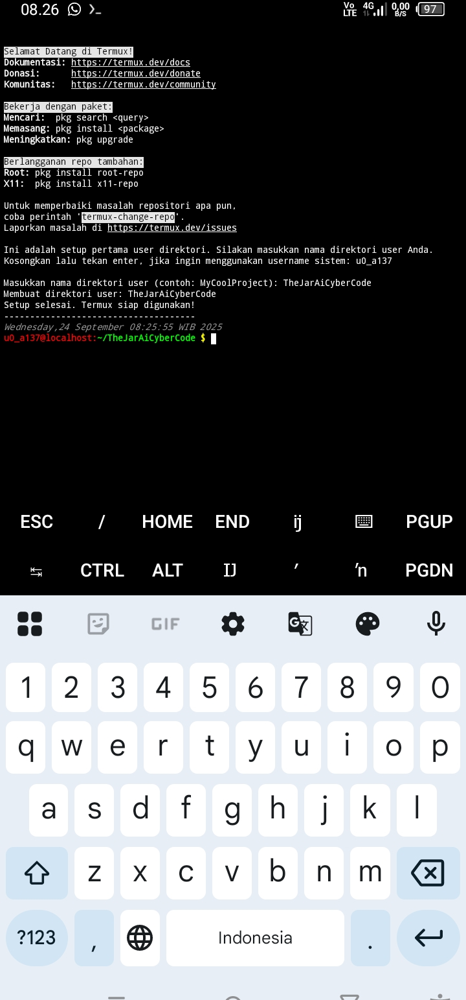
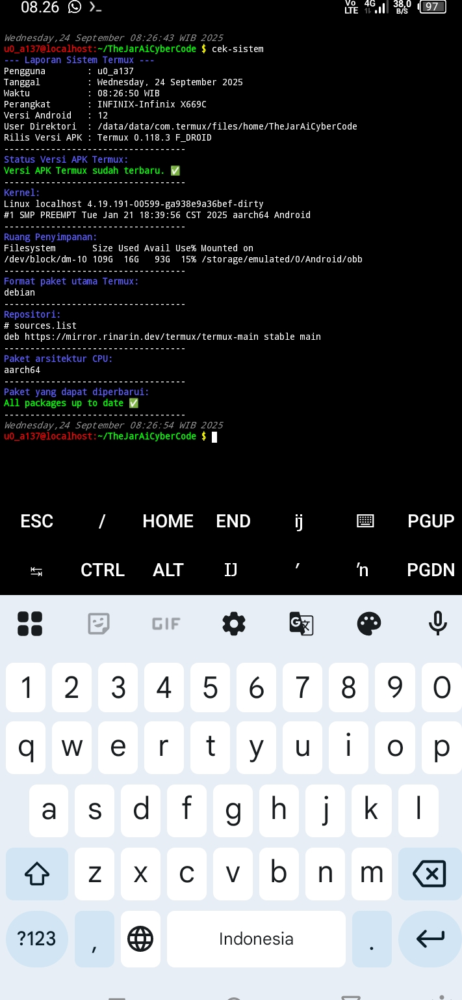

# Termux-Home
Repositori termux-home ini berisi kumpulan file konfigurasi dan skrip yang ada di ~/home Termux
yang bisa digunakan untuk kustomisasi dan optimasi fungsionalitas serta tampilan di aplikasi Termux.

---

## Prasyarat
+ Aplikasi [Termux](https://termux.dev/en/)
+ Perintah `git` sudah terpasang. Jika belum, jalankan:
```bash
pkg install git
```
+ Perintah `rsync` sudah terpasang. Jika belum, jalankan:
```bash
pkg install rsync
```

## Instalasi
1. Melakukan kloning repositori termux-home
```bash
git clone https://github.com/TheJarAiCyberCode-Official/termux-home.git
```
2. Masuk ke direktori termux-home
```bash
cd termux-home/
```
3. Salin semua file dari termux-home ke direktori ~/home Termux. kecuali folder .git images dan file README.md.
```bash
rsync -arv --exclude='.git' --exclude='images' --exclude='README.md' ./ /data/data/com.termux/files/home/
```
4. Keluar dari sesi termux saat ini, lalu buka kembali aplikasi Termux untuk menerapkan perubahan konfigurasi **termux-home**.
   + Proses instalasi telah selesai, maka akan di arahkan untuk setup awal sederhana
     seperti yang ada pada gambar berikut
     
     
---

## Penjelasan Singkat File dan Direktori
Berikut adalah penjelasan singkat untuk setiap file dan direktori yang ada di dalam repositori ini:

- **`.bashrc`**  : File ini berisi konfigurasi untuk tampilan prompt terminal (**`PS1`**) dan kumpulan alias atau pintasan perintah yang memudahkan Anda dalam menggunakan terminal.
- **`.profile`** : Digunakan untuk mengonfigurasi pengaturan awal Termux, termasuk membuat direktori kerja (*working directory*) pertama kali saat Anda menjalankan aplikasi. Skrip ini juga memastikan direktori `~/bin` ada dan menambahkan lokasinya ke **`PATH`**.
- **`.nanorc`**  : File konfigurasi untuk editor teks **`nano`**. Berisi pengaturan seperti, *syntax highlighting* ,menampilkan nomor baris, dan beberapa pintasan keyboard (*shortcut*) kustom.

### **`.termux/`** :
Direktori ini menyimpan konfigurasi khusus untuk aplikasi Termux.
- **`termux.properties`** : File ini mengatur properti aplikasi Termux, seperti gaya kursor, kecepatan berkedip kursor, dan konfigurasi tombol ekstra (*extra-keys*) yang muncul di atas keyboard virtual.

- **`motd.sh`** : Skrip ini akan menampilkan pesan sambutan (*message of the day*) saat Termux dibuka. Pesan ini berisi informasi penting seperti dokumentasi, donasi, komunitas, dan cara menggunakan *package manager*.

### **`bin/`**
Direktori ini berfungsi untuk menyimpan skrip yang bisa dieksekusi dari mana saja di terminal dengan hanya cukup mengetik `nama-skrip` nya saja. Skrip yang ada di direktori ini adalah:
  - **`cek-sistem`**: Skrip bash yang berfungsi untuk mengecek status sistem, seperti versi APK Termux, informasi kernel, sisa ruang penyimpanan, dan daftar paket yang bisa diperbarui. Contoh tampilannya seperti yang ada pada gambar di bawah

    
