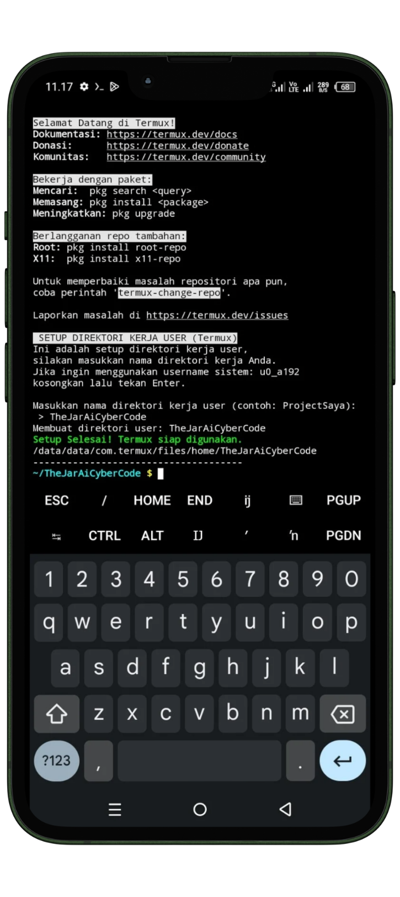
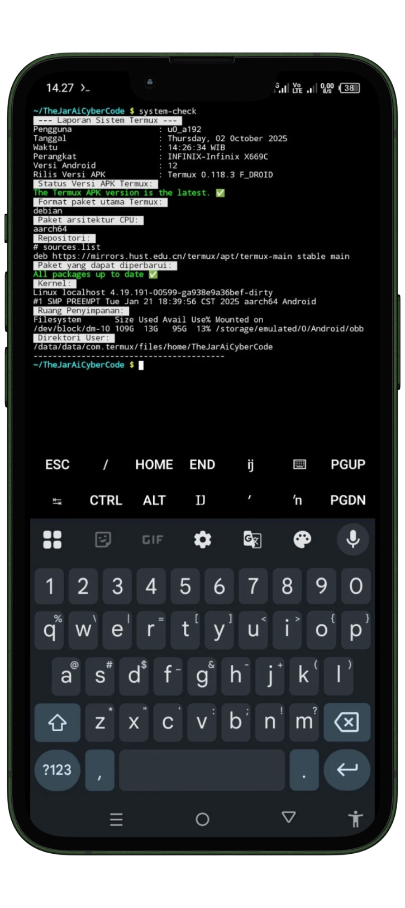

# Termux Home (Beranda Termux)

Kustomisasi dan optimasi fungsionalitas serta tampilan di aplikasi Termux.
Repositori ini menyediakan kumpulan file konfigurasi dan skrip siap pakai untuk memperindah, mempercepat,
serta meningkatkan pengalaman penggunaan Termux di Android.

---

## Fitur Utama

- Kustom prompt terminal (PS1) dengan tema menarik dan informatif.
- Kumpulan alias & fungsi shell untuk mempercepat akses perintah umum.
- Konfigurasi awal Termux agar siap pakai (auto-setup direktori kerja, dll).
- Pesan sambutan (Message of The Day) otomatis saat Termux dibuka.
- Skrip cek status sistem (system-check) untuk mengetahui info versi, storage, dll.
- Pengaturan editor nano yang nyaman (shortcut, dsb).
- Konfigurasi properti Termux, seperti kecepatan scroll dan bentuk kursor.

---

## Prasyarat

Sebelum mulai, pastikan:
- Aplikasi [Termux](https://termux.dev/en/) sudah terpasang.
- Perintah `git` sudah tersedia. Jika belum, jalankan:
  ```bash
  pkg install git
  ```
- Perintah `rsync` sudah tersedia. Jika belum, jalankan:
  ```bash
  pkg install rsync
  ```

---

## Instalasi

+ Cara paling sederhana dan cepat bisa langsung unduh skrip
[`install-termux-home.sh`](https://github.com/TheJarAiCyberCode-Official/termux-home/install-termux-home.sh)
dan berikan izin eksekusi, jalankan perintah berikut di Termux:
```bash
wget https://thejaraicybercode-official.github.io/termux-home/install-termux-home.sh
chmod 700 install-termux-home.sh
```

+ Setelah berhasil mengunduh jalankan skrip
```bash
./install-termux-home.sh
```

+ Tutup sesi Termux lalu buka kembali agar konfigurasi baru diterapkan.
  - Pada pembukaan pertama, akan ada proses setup awal sederhana.
   

---

## Struktur Direktori & Penjelasan File

| File/Folder         | Penjelasan Singkat                                                                  |
|---------------------|-------------------------------------------------------------------------------------|
| `.bashrc`           | Konfigurasi prompt terminal, alias, dan fungsi shell.                               |
| `.profile`          | Setup awal Termux, pembuatan direktori kerja, dsb.                                  |
| `.nanorc`           | Pengaturan editor nano (shortcut, dsb).                                             |
| `.termux/`          | Konfigurasi khusus aplikasi Termux.                                                 |
| `.termux/termux.properties` | Properti aplikasi Termux, seperti kecepatan scroll dan model kursor.        |
| `.termux/motd.sh`   | Skrip untuk menampilkan pesan sambutan otomatis saat Termux dibuka.                 |
| `usr/bin/system-check`    | Skrip bash untuk cek info sistem Termux dan lingkungan Android.               |
| `images/`           | Folder gambar dokumentasi (tidak perlu di-copy ke $HOME).                           |

---

### Penjelasan Skrip usr/bin/system-check

**usr/bin/system-check**
Skrip untuk menampilkan informasi sistem Termux dan perangkat Android, seperti:
- Versi APK Termux
- Storage (penyimpanan)
- Paket yang dapat diperbarui
- Kernel & device info
- Direktori Kerja User

**Cara menggunakan:**

```bash
system-check
```
Contoh output:



- Untuk mengaktifkan fungsi Cek Update Versi APK Termux. 
Skrip `system-check` membutuhkan `curl` dan `jq` yang sudah terpasang. Jika belum, jalankan:

```
pkg install curl jq
```
---

## Contoh Penggunaan Alias dan Fungsi

Setelah instalasi, Anda dapat menggunakan berbagai alias yang sudah tersedia di terminal, misal:
- `ll`  : ls -alhF
- `upg` : pkg update && pkg upgrade
- `py`  : python
- dst. (lihat di file `.bashrc` untuk daftar lengkap)

---

## Kontribusi

Kontribusi sangat terbuka!
- Fork repo ini.
- Buat branch fitur atau perbaikan Anda.
- Pull request dengan deskripsi jelas.
- Untuk pertanyaan, bug, atau request fitur, silakan buka issue di GitHub.

---

## FAQ / Troubleshooting

**Question:** Setelah instalasi, kenapa Termux saya error atau tidak berubah?
<br>
**Answer:** Pastikan sudah menutup semua sesi Termux sebelum membuka ulang,
dan file sudah tersalin ke `$HOME` dengan benar.

**Question:** Apakah konfigurasi ini bisa merusak file lama saya?
<br>
**Answer:** Backup file penting Anda sebelum menimpa konfigurasi.
Script ini menimpa file seperti `.bashrc`, `.profile`, dll.

---

## Lisensi

Silakan gunakan, modifikasi & distribusikan sesuai kebutuhan Anda. Lisensi:
[GNU General Public License v3.0.](https://github.com/TheJarAiCyberCode-Official/termux-home/blob/main/LICENSE)

---

## Kontak & Dukungan

Untuk pertanyaan, saran, atau kolaborasi lebih lanjut.
Hubungi [TheJarAiCyberCode-Official](https://github.com/TheJarAiCyberCode-Official)
