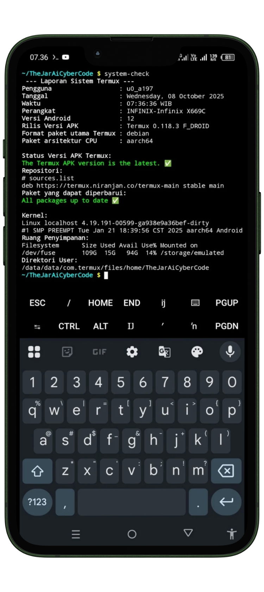

# Termux Home (Beranda Termux)

Kustomisasi dan optimasi fungsionalitas serta tampilan di aplikasi Termux.
Repositori ini menyediakan kumpulan file konfigurasi dan skrip siap pakai untuk memperindah, mempercepat,
serta meningkatkan pengalaman penggunaan Termux di Android.

---

## Prasyarat

Sebelum mulai, pastikan:
- Aplikasi [Termux](https://termux.dev/en/) sudah terpasang.
- Perintah `git` sudah tersedia. Jika belum, jalankan:

  ```bash
  pkg install git
  ```

- Perintah `rsync` sudah tersedia. Jika belum, jalankan:

  ```bash
  pkg install rsync
  ```

- Perintah `wget` sudah tersedia. Jika belum, jalankan:

  ```bash
  pkg install wget
  ```

---

## Instalasi

+ Cara paling sederhana dan cepat, unduh dan jalankan skrip
[`install-termux-home.sh`](https://github.com/TheJarAiCyberCode-Official/termux-home/blob/main/install-termux-home.sh)
jalankan perintah berikut di Termux:

+ Unduh dan berikan izin eksekusi

```bash
wget https://raw.githubusercontent.com/TheJarAiCyberCode-Official/termux-home/main/install-termux-home.sh
chmod +x install-termux-home.sh
```

+ Setelah berhasil mengunduh, jalankan skrip

```bash
./install-termux-home.sh
```

+ Lanjutkan, ikuti sesuai intruksi yang keluar dari skrip `install-termux-home.sh` dengan seksama

#### Pada pembukaan pertama, akan ada proses setup awal sederhana. Seperti berikut:

   

---

## Penjelasan Struktur Direktori & File

| File/Folder                       | Penjelasan Singkat                                                                             |
|-----------------------------------|------------------------------------------------------------------------------------------------|
| `.bashrc`                         | File konfigurasi utama shell ini berisi pengaturan dasar dan tampilan                          |
| `.bash_aliases`                   | Kumpulan shortcut (perintah singkat)                                                           |
| `.profile`                        | Inisialisasi Lingkungan Termux Otomatis seperti pembuatan direktori kerja                      |
| `.nanorc`                         | Pengaturan editor nano (shortcut, dsb).                                                        |
| `install-termux-home.sh`          | Skrip untuk instalasi cepat `termux-home`                                                      |
| `.termux/`                        | Konfigurasi khusus aplikasi Termux.                                                            |
| `.termux/termux.properties`       | Properti aplikasi Termux, seperti kecepatan scroll dan model kursor.                           |
| `.termux/motd.sh`                 | Skrip untuk menampilkan pesan sambutan otomatis saat Termux dibuka.                            |
| `usr/bin/`                        | Simpan skrip yang dibuat user, dijalankan langsung dari terminal dengan mengetik namanya saja. |
| `usr/bin/system-check`            | Skrip Bash untuk cek info sistem Termux dan lingkungan Android.                                |
| `usr/bin/backup-termux-encrypted` | Skrip Bash untuk mencadangkan data Termux dan dienkripsi menggunakan openssl                   |
| `images/`                         | Folder gambar dokumentasi (tidak perlu di-copy ke $HOME).                                      |


---

### Penjelasan Skrip yang ada di ~/usr/bin/

1. **system-check**
Skrip untuk menampilkan informasi sistem Termux dan perangkat Android, seperti:
- Versi APK Termux
- Storage (penyimpanan)
- Paket yang dapat diperbarui
- Kernel & device info
- Direktori Kerja User

**Cara menggunakan:**

```bash
system-check
```
Contoh output:



- Untuk mengaktifkan fungsi Cek Update Versi APK Termux. 
Skrip `system-check` membutuhkan `curl` dan `jq` yang sudah terpasang. Jika belum, jalankan:

```
pkg install curl jq
```
---

## Contoh Penggunaan Alias dan Fungsi

Setelah instalasi, Anda dapat menggunakan berbagai alias yang sudah tersedia di terminal, misal:
- `upg` : pkg update && pkg upgrade
- `py`  : python
- dst. (lihat di file [.bash_aliases](https://github.com/TheJarAiCyberCode-Official/termux-home/blob/main/.bash_aliases) untuk daftar lengkap alias yang tersedia)

---

## Kontribusi

Kontribusi sangat terbuka!
- Fork repo ini.
- Buat branch fitur atau perbaikan Anda.
- Pull request dengan deskripsi jelas.
- Untuk pertanyaan, bug, atau request fitur, silakan buka issue di GitHub.

---

## Lisensi

Silakan gunakan, modifikasi & distribusikan sesuai kebutuhan Anda. Lisensi:
[GNU General Public License v3.0.](https://github.com/TheJarAiCyberCode-Official/termux-home/blob/main/LICENSE)

---

## Kontak & Dukungan

Untuk pertanyaan, saran, atau kolaborasi lebih lanjut.
Hubungi [TheJarAiCyberCode-Official](https://github.com/TheJarAiCyberCode-Official)
